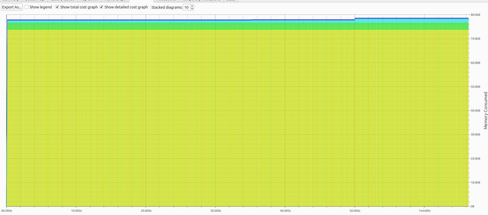
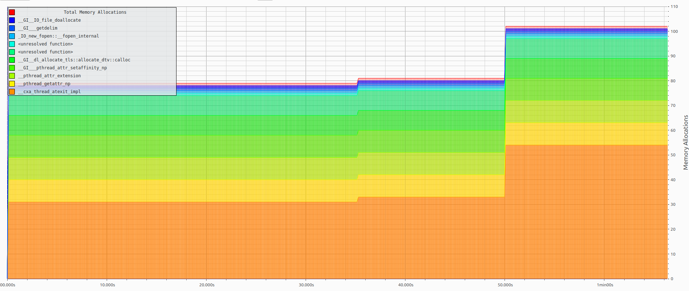

# FerroTunnel 🦀

[](https://github.com/MitulShah1/ferrotunnel/actions/workflows/ci.yml)
[](https://crates.io/crates/ferrotunnel)
[](https://docs.rs/ferrotunnel)
[](LICENSE)
[](https://www.rust-lang.org)

**High-performance reverse tunnel you can embed in your Rust applications.**

FerroTunnel multiplexes streams over a single connection (like ngrok/Cloudflare Tunnel) but ships as a **library-first** crate. Expose local services behind NAT, route HTTP by hostname, intercept requests with plugins with minimal memory footprint and sub-millisecond latency. Works as CLI or `Client::builder()` API. Written in Rust.


## Prerequisites

- **Rust 1.90+**: FerroTunnel uses modern Rust features for performance and safety.
- **Cargo**: Required for building and installing from source.
- **Git**: For cloning the repository during development.

## Quick Start

### CLI

```bash
# Install
cargo install ferrotunnel-cli

# Start server
ferrotunnel server --token secret

# Start client (in another terminal; token from env or secure prompt if omitted)
ferrotunnel client --server localhost:7835 --local-addr 127.0.0.1:8080 --tunnel-id my-app
```

### Library

```toml
[dependencies]
ferrotunnel = "1.0"
tokio = { version = "1", features = ["full"] }
```

```rust
use ferrotunnel::Client;

#[tokio::main]
async fn main() -> ferrotunnel::Result<()> {
    let mut client = Client::builder()
        .server_addr("tunnel.example.com:7835")
        .token("my-secret-token")
        .local_addr("127.0.0.1:8080")
        .tunnel_id("my-app")
        .build()?;

    client.start().await?;

    tokio::signal::ctrl_c().await?;
    client.shutdown().await
}
```

### HTTP/2 and Connection Pooling

FerroTunnel v1.0.3+ includes automatic HTTP/2 support and connection pooling for improved performance:

**Server-side**: The HTTP ingress automatically detects and handles both HTTP/1.1 and HTTP/2 connections from clients.

**Client-side**: Connection pooling reuses HTTP connections to local services, eliminating per-request TCP handshake overhead:

```rust
use ferrotunnel_http::{HttpProxy, PoolConfig};
use std::time::Duration;

// Create proxy with custom pool configuration
let pool_config = PoolConfig {
    max_idle_per_host: 32,           // Max idle connections per host (default: 32)
    idle_timeout: Duration::from_secs(90), // Connection idle timeout (default: 90s)
    prefer_h2: false,                 // Prefer HTTP/2 when available (default: false)
};

let proxy = HttpProxy::with_pool_config("127.0.0.1:8080".into(), pool_config);
```

**CLI**: Use default pool settings (no flags needed) or customize via the library API.

**Benefits**:
- 🚀 Eliminates TCP handshake overhead per request
- 🔄 HTTP/2 multiplexing reduces connection count
- 🧹 Background eviction prevents resource leaks
- 📈 Significantly improves throughput (target: 800-1000 MB/s)

## Features

| Feature | Description |
|---------|-------------|
| **Embeddable** | Use as a library with builder APIs |
| **HTTP/2** | Automatic HTTP/1.1 and HTTP/2 protocol detection |
| **Connection Pooling** | Efficient connection reuse for improved performance |
| **Plugin System** | Auth, rate limiting, logging, circuit breaker |
| **Dashboard** | Real-time WebUI at `localhost:4040` |
| **TLS 1.3** | Secure connections with rustls |
| **Mutual TLS** | Client certificate authentication |
| **Observability** | Prometheus metrics + OpenTelemetry tracing |
| **WebSocket** | Transparent WebSocket upgrade tunneling |
| **TCP & HTTP** | Forward both HTTP and raw TCP traffic |


**Choose FerroTunnel when**: You need many services over a single connection, HTTP routing, plugins, or resource efficiency.

See [Architecture](/docs/ARCHITECTURE.md) for detailed analysis of the multiplexing trade-off.

## Security: Why Rust Matters

Traditional C/C++ tunneling solutions (OpenSSH, OpenVPN, stunnel) have suffered from **30+ critical memory safety vulnerabilities** over the past decade—buffer overflows, use-after-free, double-free, race conditions, and heap corruption.

**FerroTunnel eliminates these entire vulnerability classes at compile time** using Rust's ownership system:

- ✅ **Zero unsafe code** (`#![forbid(unsafe)]` at workspace level)
- ✅ **Memory safety guaranteed** (no buffer overflows, use-after-free, double-free)
- ✅ **Thread safety enforced** (no data races possible)
- ✅ **Pure Rust crypto** (rustls instead of OpenSSL—zero legacy vulnerabilities)

**Security Features:**
- TLS 1.3-only enforcement with mutual TLS support
- Token-based authentication with constant-time comparison
- Built-in rate limiting and frame size limits
- Automated dependency scanning (`cargo-audit` in CI)

See [docs/security.md](docs/security.md) for detailed CVE comparison, vulnerability analysis, and security best practices.

## Ideal For

FerroTunnel's **memory-safe architecture** and **minimal resource footprint** make it perfect for security-critical and resource-constrained environments:

- 🔐 **Crypto & Blockchain Infrastructure** - High security requirements, integrates seamlessly with Rust blockchain ecosystems (Solana, Polkadot, Cosmos)
- 📡 **IoT Devices** - Low memory overhead (<100MB/1k tunnels), zero memory vulnerabilities, ideal for edge gateways and smart devices
- ⚡ **Edge Computing** - Sub-millisecond latency, efficient resource usage, compile-time safety guarantees
- 🖥️ **Embedded Systems** - No garbage collector, predictable performance, cross-compilation friendly
- 🏢 **Enterprise Security** - Zero unsafe code, automated dependency scanning, compliance-ready audit trails

**Why it matters:** Traditional C/C++ tunnels require constant security patches for memory vulnerabilities. Embedded/IoT devices often can't be easily updated, making Rust's compile-time safety guarantees essential.

## CLI Reference


### Server

```bash
ferrotunnel server [OPTIONS]
```

| Option | Env Variable | Default | Description |
|--------|--------------|---------|-------------|
| `--token` | `FERROTUNNEL_TOKEN` | required | Auth token |
| `--bind` | `FERROTUNNEL_BIND` | `0.0.0.0:7835` | Control plane |
| `--http-bind` | `FERROTUNNEL_HTTP_BIND` | `0.0.0.0:8080` | HTTP ingress |
| `--tcp-bind` | `FERROTUNNEL_TCP_BIND` | - | TCP ingress |
| `--tls-cert` | `FERROTUNNEL_TLS_CERT` | - | TLS certificate |
| `--tls-key` | `FERROTUNNEL_TLS_KEY` | - | TLS private key |

### Client

```bash
ferrotunnel client [OPTIONS]
```

| Option | Env Variable | Default | Description |
|--------|--------------|---------|-------------|
| `--server` | `FERROTUNNEL_SERVER` | required | Server address |
| `--token` | `FERROTUNNEL_TOKEN` | optional | Auth token; if omitted, uses env or prompts securely |
| `--local-addr` | `FERROTUNNEL_LOCAL_ADDR` | `127.0.0.1:8000` | Local service |
| `--tunnel-id` | `FERROTUNNEL_TUNNEL_ID` | (auto) | Tunnel ID for HTTP routing |
| `--dashboard-port` | `FERROTUNNEL_DASHBOARD_PORT` | `4040` | Dashboard port |
| `--tls` | `FERROTUNNEL_TLS` | false | Enable TLS |
| `--tls-ca` | `FERROTUNNEL_TLS_CA` | - | CA certificate |

See [ferrotunnel-cli/README.md](ferrotunnel-cli/README.md) for all options.

## Crates

| Crate | Description |
|-------|-------------|
| [`ferrotunnel`](ferrotunnel/) | Main library with builder APIs |
| [`ferrotunnel-cli`](ferrotunnel-cli/) | Unified CLI binary |
| [`ferrotunnel-core`](ferrotunnel-core/) | Tunnel logic and transport |
| [`ferrotunnel-protocol`](ferrotunnel-protocol/) | Wire protocol and codec |
| [`ferrotunnel-http`](ferrotunnel-http/) | HTTP/TCP ingress and proxy |
| [`ferrotunnel-plugin`](ferrotunnel-plugin/) | Plugin system |
| [`ferrotunnel-observability`](ferrotunnel-observability/) | Metrics and dashboard |
| [`ferrotunnel-common`](ferrotunnel-common/) | Shared types |

## Installation

### Pre-built Binaries

Download from [GitHub Releases](https://github.com/MitulShah1/ferrotunnel/releases).

### From Source

```bash
cargo install ferrotunnel-cli
```

### macOS (Homebrew)

```bash
brew tap MitulShah1/ferrotunnel
brew install ferrotunnel
```

### Docker

#### Using Pull

You can pull the official image from GitHub Container Registry:

```bash
# Pull the latest image
docker pull ghcr.io/mitulshah1/ferrotunnel:latest

# Run as a server
docker run -p 7835:7835 -p 8080:8080 ghcr.io/mitulshah1/ferrotunnel:latest server --token secret
```

#### Using Docker Compose

For more complex setups, use the provided `docker-compose.yml`:

```bash
docker-compose up --build
```

## Documentation

- [CLI Reference](ferrotunnel-cli/README.md)
- [Contributing](CONTRIBUTING.md) & [Code of Conduct](CODE_OF_CONDUCT.md)
- [Architecture](docs/ARCHITECTURE.md)
- [Benchmark & Performance](docs/benchmark.md)
- [Deployment Guide](docs/deployment.md)
- [Plugin Development](docs/plugin-development.md)
- [Security](docs/security.md)

## Development

```bash
# Build
cargo build --workspace

# Test
cargo test --workspace

# Lint
cargo clippy --workspace --all-targets -- -D warnings

# Benchmark
cargo bench --workspace
```

### Developer Tools

- [`tools/loadgen`](tools/loadgen/) - Load testing
- [`tools/soak`](tools/soak/) - Stability testing
- [`tools/profiler`](tools/profiler/) - Performance profiling

## Benchmark

FerroTunnel is benchmarked against [rathole](https://github.com/rapiz1/rathole) and [frp](https://github.com/fatedier/frp). Unlike rathole/frp which use 1:1 TCP forwarding, FerroTunnel uses **multiplexed streams over a single connection** the same architecture used by [ngrok](https://ngrok.com/docs/http/) and [Cloudflare Tunnel](https://developers.cloudflare.com/speed/optimization/protocol/http2-to-origin/) (HTTP/2 multiplexing). This enables HTTP routing, plugins, and multi-service tunnels.

<p align="center">
  
  
</p>
<p align="center"><em>Memory profile: flat heap usage, minimal allocations under load</em></p>

See [docs/benchmark.md](docs/benchmark.md) for detailed analysis of the architectural trade-offs.

## License

Licensed under either of [Apache License 2.0](LICENSE-APACHE) or [MIT](LICENSE-MIT) at your option.
