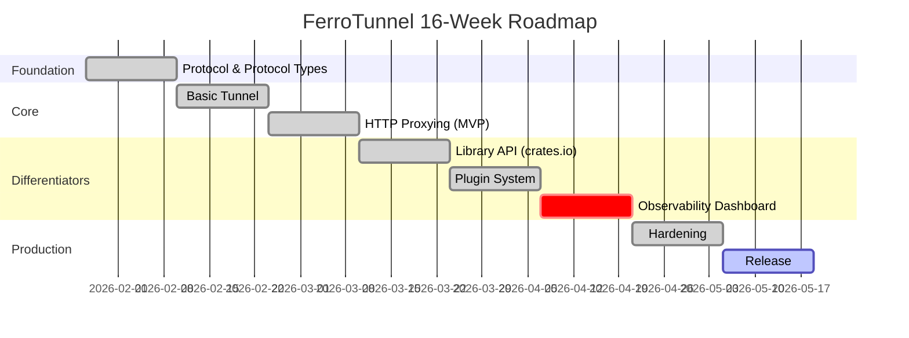

# FerroTunnel Development Roadmap

16-week journey from idea to production-ready embeddable reverse tunnel

---

## Vision

**FerroTunnel** is not just another tunnel - it's the **embeddable**, **extensible**, and **observable** reverse tunnel for Rust developers.

### Core Differentiators

🎯 **Library-First** - Published to crates.io, embedded in your apps
🎯 **Plugin System** - Trait-based extensibility for custom behavior (Next)
🎯 **Built-in Dashboard** - Real-time WebUI for monitoring

---

## Release Strategy



---

## Phase Breakdown

### 🔧 Phase 1: Foundation (Weeks 1-2)

**Status**: ✅ Completed
**Goal**: Working protocol and workspace structure

#### Deliverables
- Cargo workspace with all crate scaffolding
- Protocol message types (Frame enum)
- Bincode encoder/decoder
- Unit tests (100% coverage for protocol)
- Error types and common utilities

#### Success Criteria
- ✅ All messages serialize/deserialize correctly
- ✅ Codec handles malformed input gracefully
- ✅ Zero compiler warnings
- ✅ Documentation coverage > 80%

#### Key Files
- `crates/ferrotunnel-protocol/src/frame.rs` - Frame definitions
- `crates/ferrotunnel-protocol/src/codec.rs` - Encoder/Decoder
- `crates/ferrotunnel-common/src/error.rs` - Error types

---

### 🔌 Phase 2: Basic Tunnel (Weeks 3-4)

**Status**: ✅ Completed
**Goal**: CLI client and server establish connection

#### Deliverables
- Server TCP accept loop
- Client connection logic
- Handshake protocol implementation
- Session management (in-memory)
- Heartbeat mechanism (30s interval)
- CLI binaries (`ferrotunnel-server`, `ferrotunnel-client`)

#### Success Criteria
- ✅ Client connects and authenticates
- ✅ Heartbeats maintain connection
- ✅ Graceful shutdown on Ctrl+C
- ✅ Integration test: handshake flow

#### Key Files
- `crates/ferrotunnel-core/src/tunnel/server.rs`
- `crates/ferrotunnel-core/src/tunnel/client.rs`
- `crates/ferrotunnel-cli/src/main.rs`

---

### 🌐 Phase 3: HTTP Proxying (Weeks 5-6)

**Status**: ✅ Completed
**Goal**: Functional HTTP tunnel (MVP)

#### Deliverables
- Hyper HTTP ingress server
- Stream multiplexing (YAMUX or custom)
- HTTP request → Frame conversion
- Client TCP proxy to local service
- Bidirectional data streaming
- End-to-end HTTP test

#### Success Criteria
- ✅ `curl` works through tunnel
- ✅ 100 concurrent requests handled
- ✅ Large file uploads/downloads work
- ✅ Proper error handling

#### Key Files
- `crates/ferrotunnel-http/src/ingress.rs`
- `crates/ferrotunnel-http/src/proxy.rs`
- `crates/ferrotunnel-core/src/stream/multiplexer.rs`

**🎉 Milestone: MVP Working!**

---

### 📦 Phase 4: Library API (Weeks 7-8)

**Status**: ✅ Completed
**Goal**: 🎯 First Differentiator - Embeddable Library

#### Deliverables
- Public API crate (`ferrotunnel`)
- Client builder pattern
- Server builder pattern
- Configuration types
- Usage examples (embedded client/server)
- Documentation for library users
- **Publish to crates.io**

#### Example API
```rust
use ferrotunnel::Client;

let client = Client::builder()
    .server_url("wss://tunnel.example.com")
    .token(token)
    .local_address("127.0.0.1:8080")
    .build()?;

let info = client.start().await?;
println!("Public URL: {}", info.public_url);
```

#### Success Criteria
- ✅ Published to crates.io as `ferrotunnel`
- ✅ Rustdoc complete with examples
- ✅ `examples/embedded_client.rs` works
- ✅ README has library usage section

#### Key Files
- `crates/ferrotunnel/src/lib.rs` - Public exports
- `crates/ferrotunnel/src/client.rs` - Client builder
- `crates/ferrotunnel/src/server.rs` - Server builder
- `examples/embedded_client.rs`

**🎯 Differentiator #1: Only embeddable Rust tunnel!**

---

### 🔌 Phase 5: Plugin System (Weeks 9-10)

**Status**: 🎯 Next
**Goal**: 🎯 Second Differentiator - Extensibility

#### Deliverables
- Plugin trait definition
- Plugin registry and lifecycle management
- Plugin contexts (request/response/stream)
- Built-in plugins:
  - Request logger
  - Token-based auth
  - Rate limiter
- Example custom plugin
- Plugin developer guide

#### Example Plugin
```rust
use ferrotunnel_plugin::{Plugin, PluginAction};

#[async_trait]
impl Plugin for CustomAuth {
    async fn on_request(&self, req: &mut Request, ctx: &RequestContext)
        -> Result<PluginAction>
    {
        if !validate_token(req.headers()) {
            return Ok(PluginAction::Reject {
                status: 401,
                reason: "Unauthorized".into()
            });
        }
        Ok(PluginAction::Continue)
    }
}
```

#### Success Criteria
- ✅ Plugin trait well-documented
- ✅ 3+ built-in plugins working
- ✅ Community plugin example
- ✅ Plugin guide in `docs/plugin-guide.md`

#### Key Files
- `crates/ferrotunnel-plugin/src/traits.rs` - Plugin trait
- `crates/ferrotunnel-plugin/src/registry.rs` - Registry
- `crates/ferrotunnel-plugin/src/builtin/*` - Built-in plugins
- `plugins/hello-plugin/` - Example plugin

**🎯 Differentiator #2: Only extensible Rust tunnel!**

---

### 📊 Phase 6: Observability (Weeks 11-12)

**Status**: ⏳ Planned
**Goal**: 🎯 Third Differentiator - Built-in Dashboard

#### Deliverables
- Dashboard server (Axum + SSE)
- REST API for tunnel/stream data
- Real-time WebUI:
  - Active tunnels list
  - Request/response viewer
  - Traffic graphs
  - Error monitoring
- Prometheus metrics endpoint
- OpenTelemetry integration
- Dashboard documentation

#### Dashboard Features
```
http://localhost:9090/
├── Dashboard
│   ├── Active Tunnels (live count)
│   ├── Request Rate (graph)
│   ├── Error Rate (graph)
│   └── Recent Requests (table)
├── Tunnels
│   ├── List view
│   └── Detail view (per tunnel)
├── Requests
│   ├── Live viewer
│   ├── Request details
│   └── Response details
└── Metrics
    └── Prometheus endpoint
```

#### API Endpoints
```
GET  /api/tunnels              # List active tunnels
GET  /api/tunnels/{id}         # Tunnel details
GET  /api/requests             # Recent requests
GET  /api/metrics              # Prometheus metrics
GET  /api/events               # SSE for real-time updates
GET  /                         # Dashboard UI
```

#### Success Criteria
- ✅ Dashboard accessible at `http://localhost:9090`
- ✅ Real-time updates via Server-Sent Events
- ✅ Request/response viewable (like ngrok inspect)
- ✅ Prometheus metrics work
- ✅ OpenTelemetry traces exported

#### Key Files
- `crates/ferrotunnel-observability/src/dashboard/server.rs`
- `crates/ferrotunnel-observability/src/dashboard/api.rs`
- `crates/ferrotunnel-observability/src/dashboard/static/index.html`
- `crates/ferrotunnel-observability/src/metrics.rs`

**🎯 Differentiator #3: Only Rust tunnel with built-in dashboard!**

---

### 🛡️ Phase 7: Hardening (Weeks 13-14)

**Status**: ✅ Completed
**Goal**: Production-ready reliability and security

#### Deliverables

**Security**
- TLS 1.3 with rustls
- Token-based authentication
- Rate limiting per tunnel
- Input validation and sanitization

**Resilience**
- Exponential backoff reconnection
- Connection pooling
- Circuit breakers
- Resource limits (max connections, memory)

**Testing**
- Load testing (1000 concurrent streams)
- Memory leak detection (24h soak test)
- Fuzzing (protocol decoder)
- Security audit
- Performance benchmarks vs Rathole

**Documentation**
- Deployment guide
- Security best practices
- Troubleshooting guide

#### Success Criteria
- ✅ No crashes in 7-day soak test
- ✅ < 5ms latency overhead vs raw TCP
- ✅ < 100MB memory for 1000 tunnels
- ✅ All security audit items addressed
- ✅ Fuzzing passes without crashes

#### Key Files
- `crates/ferrotunnel-core/src/transport/tls.rs`
- `crates/ferrotunnel-core/src/reconnect.rs`
- `docs/deployment.md`
- `docs/security.md`

**🎉 Milestone: v1.0.0-rc1 tagged**

---

### 🚀 Phase 8: Release (Weeks 15-16)

**Status**: ⏳ Planned
**Goal**: Public launch of FerroTunnel v1.0.0

#### Deliverables

**Documentation**
- Complete README with features, installation, usage
- Architecture documentation
- Library embedding guide
- Plugin development guide
- Deployment guide
- API reference (rustdoc)

**Release Artifacts**
- Pre-built binaries (Linux, macOS, Windows)
- Docker images (server, client)
- Kubernetes manifests
- Homebrew formula (optional)

**Community**
- Contributing guidelines
- Code of conduct
- Issue templates
- PR templates

**Marketing**
- Blog post: "Introducing FerroTunnel"
- Blog post: "Building a Plugin System in Rust"
- Submit to awesome-rust
- Post on r/rust
- Share on Twitter/Hacker News
- Submit to This Week in Rust

#### Success Criteria
- ✅ Published to crates.io as v1.0.0
- ✅ GitHub release with binaries
- ✅ Docker images on Docker Hub
- ✅ Documentation complete
- ✅ Blog posts published
- ✅ Community guidelines in place

**🎉 Milestone: v1.0.0 Released!**

---

## Version Strategy

### v0.x Releases (During Development)

- **v0.1.0** - Protocol working (Week 2) ✅
- **v0.2.0** - Basic tunnel (Week 4) ✅
- **v0.3.0** - HTTP proxying (Week 6) - **MVP** ✅
- **v0.4.0** - Library API (Week 8) - **Publish to crates.io** ✅
- **v0.5.0** - Plugin system (Week 10) ✅
- **v0.6.0** - Hardening & Observability (Week 14) ✅
- **v1.0.0-rc1** - Release candidate (Week 16)

### v1.0.0 (Week 16)

Stable release with all three differentiators:
- ✅ Embeddable library
- ✅ Plugin system
- ✅ Built-in dashboard

### v1.x Roadmap (Post-Launch)

- **v1.1.0** - gRPC support
- **v1.2.0** - HTTP/3 (QUIC)
- **v1.3.0** - WebSocket tunneling
- **v1.4.0** - Multi-region support
- **v1.5.0** - Custom domains
- **v2.0.0** - Breaking changes if needed

---

## Comparison with Alternatives

### vs. Rathole

| Feature | Rathole | FerroTunnel v1.0 |
|---------|---------|------------------|
| Language | Rust | Rust |
| Embeddable | ❌ | ✅ crates.io library |
| Plugin System | ❌ | ✅ Trait-based |
| Dashboard | ❌ | ✅ Built-in WebUI |
| Request Viewer | ❌ | ✅ Like ngrok inspect |
| OpenTelemetry | ❌ | ✅ Built-in |
| License | Apache-2.0 | MIT OR Apache-2.0 |

### vs. ngrok

| Feature | ngrok | FerroTunnel v1.0 |
|---------|-------|------------------|
| Open Source | ❌ | ✅ |
| Self-hosted | Limited | ✅ Full control |
| Embeddable | ❌ | ✅ Rust library |
| Plugin System | ❌ | ✅ |
| Cost | Paid tiers | Free + open |

---

## Success Metrics

### Technical Targets

- **Performance**: < 5ms latency overhead vs raw TCP
- **Scalability**: 10k concurrent streams per server
- **Efficiency**: < 100MB memory for 1000 tunnels
- **Reliability**: Zero crashes in 7-day soak test

### Community Goals

**Year 1**
- 1,000+ GitHub stars
- 50+ daily crates.io downloads
- 10+ community plugins
- Featured in Rust newsletter

**Year 2**
- 5,000+ GitHub stars
- 200+ daily crates.io downloads
- 50+ community plugins
- Used in production by 10+ companies

### Differentiation Validation

- ✅ **Only embeddable** Rust tunnel (crates.io)
- ✅ **Most extensible** via plugin system
- ✅ **Best observability** with built-in dashboard

---

## Risk Mitigation

### Technical Risks

| Risk | Impact | Mitigation |
|------|--------|------------|
| Performance doesn't match Rathole | High | Benchmark early, optimize hot paths |
| Plugin system too complex | Medium | Start simple, iterate based on feedback |
| Dashboard becomes scope creep | Medium | MVP first (basic UI), enhance later |
| QUIC/HTTP/3 too complex | Low | Move to v1.1+ if needed |

### Community Risks

| Risk | Impact | Mitigation |
|------|--------|------------|
| No community adoption | High | Marketing, clear docs, blog posts |
| Competition from Rathole | Medium | Highlight differentiators clearly |
| Contributors needed | Low | Good first issues, clear contributing guide |

---

## Development Workflow

### Branch Strategy

- `main` - Stable, tagged releases
- `develop` - Integration branch
- `feature/*` - Feature branches
- `fix/*` - Bug fix branches

### Release Process

1. Development on `feature/*` branches
2. Merge to `develop` via PR
3. Integration testing on `develop`
4. Tag release from `develop` → `main`
5. Publish to crates.io
6. Create GitHub release

### CI/CD Pipeline

```yaml
# .github/workflows/ci.yml
- Cargo check
- Cargo test (all features)
- Cargo clippy (deny warnings)
- Cargo fmt --check
- Cargo audit (dependency security)
- Cargo doc (documentation build)
- Coverage report (codecov)
```

---

## Timeline Summary

| Week | Phase | Status | Deliverable |
|------|-------|--------|-------------|
| 1-2 | Foundation | ✅ Completed | Protocol v0.1.0 |
| 3-4 | Basic Tunnel | ✅ Completed | CLI v0.2.0 |
| 5-6 | HTTP Proxy | ✅ Completed | MVP v0.3.0 |
| **7-8** | **Library API** | ✅ Completed | **🎯 crates.io v0.4.0** |
| 9-10 | Plugin System | ✅ Completed | **🎯 Plugins v0.5.0** |
| **11-12** | **Dashboard** | ⏳ Planned | **🎯 Observable v0.6.5** |
| 13-14 | Hardening | ✅ Completed | **🎯 Hardening v0.6.0** |
| 15-16 | Release | ⏳ Planned | **v1.0.0 🎉** |

**Total: 16 weeks to differentiated v1.0.0**

---

## Getting Started

Ready to build? Here's what's next:

1. ✅ Review this roadmap
2. ✅ Review [implementation_plan.md](file:///home/mitul/.gemini/antigravity/brain/8645a971-6608-4b52-855e-322cd202c7bf/implementation_plan.md)
3. ⏭️ Answer open questions (time commitment, scope priority)
4. ⏭️ Start Phase 1: Foundation (create workspace)

Let's build something unique! 🚀
