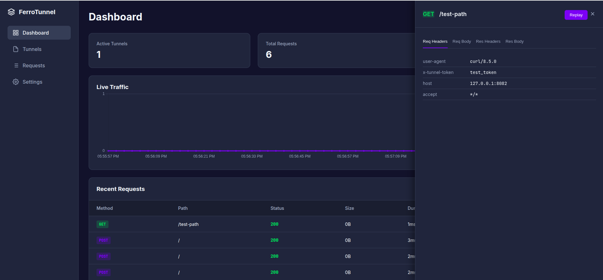

# ferrotunnel-observability 📊

Observability infrastructure for FerroTunnel, providing metrics, distributed tracing, and a real-time web dashboard.

## Features

- **Web Dashboard**: Real-time traffic inspection with request/response capture and replay
- **Prometheus Metrics**: Registry-based metrics collection for tunnel health, throughput, and latency
- **OpenTelemetry Tracing**: Distributed tracing support with OTLP/gRPC exporter
- **Structured Logging**: Pre-configured `tracing` subscriber with environment filtering
- **SSE Events**: Server-sent events for live dashboard updates

## Dashboard

The built-in dashboard provides a web UI for monitoring and debugging tunnel traffic.

### Features

- **Live Traffic Chart**: Real-time visualization of requests per second
- **Request Inspector**: View full request/response headers and bodies
- **Replay Requests**: Re-send captured requests for debugging
- **Tunnel Status**: Monitor active tunnel connections
- **Error Rate Tracking**: Track 4xx/5xx response rates

### Screenshot



### Usage

```rust
use ferrotunnel_observability::dashboard::{
    create_router, DashboardState, EventBroadcaster,
};
use std::sync::Arc;
use tokio::sync::RwLock;

#[tokio::main]
async fn main() {
    // Create dashboard state and event broadcaster
    let state = Arc::new(RwLock::new(DashboardState::new(1000))); // Keep last 1000 requests
    let broadcaster = Arc::new(EventBroadcaster::new(100));

    // Create the dashboard router
    let app = create_router(state.clone(), broadcaster.clone());

    // Serve the dashboard
    let listener = tokio::net::TcpListener::bind("127.0.0.1:4040").await.unwrap();
    axum::serve(listener, app).await.unwrap();
}
```

### API Endpoints

| Endpoint | Method | Description |
|----------|--------|-------------|
| `/` | GET | Dashboard web UI |
| `/api/v1/health` | GET | Health check with version info |
| `/api/v1/tunnels` | GET | List active tunnels |
| `/api/v1/requests` | GET | List captured requests |
| `/api/v1/requests/:id` | GET | Get full request details |
| `/api/v1/requests/:id/replay` | POST | Replay a captured request |
| `/api/v1/events` | GET | SSE stream for live updates |

### Request Details

The dashboard captures:

- **Request**: Method, path, headers, body
- **Response**: Status, headers, body
- **Metadata**: Duration, timestamp, tunnel ID

### Middleware Integration

To capture traffic, use the `DashboardCaptureLayer` middleware:

```rust
use ferrotunnel_observability::dashboard::{
    DashboardState, EventBroadcaster, DashboardEvent, RequestDetails,
};

// In your middleware, add requests to the dashboard:
let details = RequestDetails {
    id: uuid::Uuid::new_v4(),
    tunnel_id: tunnel_id,
    method: "POST".to_string(),
    path: "/api/endpoint".to_string(),
    request_headers: headers_map,
    request_body: Some(body_string),
    status: 200,
    response_headers: response_headers_map,
    response_body: Some(response_body),
    duration_ms: 45,
    timestamp: chrono::Utc::now(),
};

// Add to state
state.write().await.add_request(details.clone());

// Broadcast to SSE clients
broadcaster.send(DashboardEvent::NewRequest(details.into()));
```

## Metrics & Tracing

### CLI Usage

Observability is **disabled by default** for maximum performance. Enable it with the `--observability` flag:

```bash
# Server with observability enabled
ferrotunnel server --token secret --observability

# Client with observability enabled
ferrotunnel client --server localhost:7835 --token secret --observability
```

Or via environment variable:

```bash
export FERROTUNNEL_OBSERVABILITY=true
```

### Library Initialization

```rust
use ferrotunnel_observability::{init_basic_observability, init_minimal_logging, shutdown_tracing};

#[tokio::main]
async fn main() {
    // Option 1: Full observability (metrics + tracing + OpenTelemetry)
    init_basic_observability("my-service-name");

    // Option 2: Minimal logging only (lower overhead)
    // init_minimal_logging();

    // ... your application logic ...

    // Flush spans before exit
    shutdown_tracing();
}
```

### Metrics Endpoint (Axum)

```rust
use axum::{routing::get, Router};
use ferrotunnel_observability::gather_metrics;

let app = Router::new().route("/metrics", get(|| async { gather_metrics() }));
```

## Configuration

Environment variables:

| Variable | Description | Example |
|----------|-------------|---------|
| `RUST_LOG` | Log level filter | `info`, `debug`, `ferrotunnel=trace` |
| `OTEL_EXPORTER_OTLP_ENDPOINT` | OTLP collector endpoint | `http://localhost:4317` |

## Prometheus Metrics

| Metric | Type | Description |
|--------|------|-------------|
| `ferrotunnel_connections_total` | Counter | Total tunnel connections |
| `ferrotunnel_active_connections` | Gauge | Currently active connections |
| `ferrotunnel_bytes_transferred_total` | Counter | Bytes transferred (labels: `direction`) |
| `ferrotunnel_requests_total` | Counter | Total HTTP requests processed |
| `ferrotunnel_request_duration_seconds` | Histogram | Request latency |
| `ferrotunnel_active_streams` | Gauge | Active multiplexed streams |

## License

MIT OR Apache-2.0
